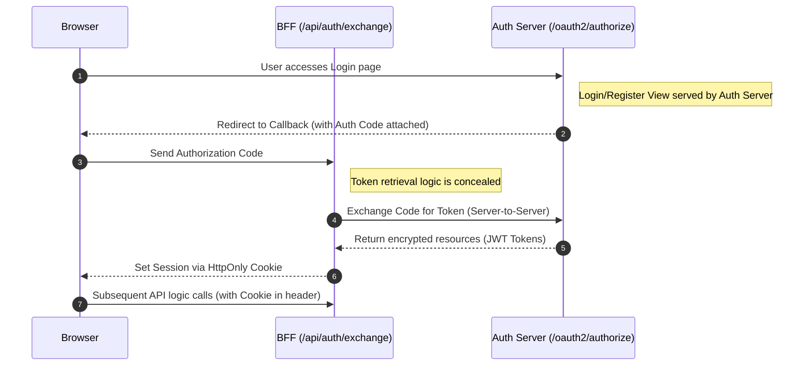

<div align="center">
  <h1>🚀 Profolio AI</h1>
  <p><i>Turn static Resumes into Interactive Portfolios - Where an AI "Persona" plays the role of YOU in front of recruiters.</i></p>

  <p>
    
    
    
    
  </p>
</div>

---

## 📋 Overview

**Profolio AI** is a groundbreaking, interactive platform that moves beyond traditional static portfolios where recruiters only "scroll" and "read".

This project allows users to upload their CV/Resume. The AI then processes, analyzes, and extracts the rich contextual data from this CV to **roleplay as the user**. 

Instead of forcing viewers to blindly search for information, when a recruiter or guest visits your Portfolio link, they will experience a direct **"mock interview" (Interactive Chat)** with the AI. The AI intelligently and naturally answers questions about your work experience, skills, projects, and education... as if you were sitting right in front of the screen answering them.

## 🌟 Core Features

- 🤖 **Interactive AI Persona**: It's not a static website. The AI assumes a persona, speaks in the first-person, and communicates with visitors/recruiters on your behalf.
- 📄 **Smart CV Context (RAG/LLM)**: Seamlessly processes and extracts knowledge from uploaded CVs, fully learning their contents.
- 🔗 **Shareable Public Links**: Generate and share your interactive portfolio via a public web link in seconds.
- 🔐 **Security & Authorization**: Strictly enforces an OAuth2 Server architecture alongside the BFF Pattern for absolute data security.

## 🚀 Tech Stack

### 🎨 Frontend (`profolio-fe`)
- **Framework & Libraries**: React 18.3.1, TypeScript 5.8.2, Vite 6.2.0
- **UI & Animation**: Tailwind CSS, Framer Motion 11.0.8
- **Network**: Axios 1.7.9

### ⚙️ Backend (`profolio-be`)

| Component | Core Technology | Function/Role |
|---|---|---|
| **API Gateway (AGW)** | Spring Boot 3.5.6, Spring Cloud Gateway, WebFlux | Entry point for incoming requests, routing, and load balancing. |
| **Authorization Server** | Spring Auth Server, Spring Security, JWT, BFF | Manages OAuth2/OIDC standard authentication, users, and authorization. |
| **Database** | PostgreSQL 12+, Flyway, Consul Discovery | Distributed storage and automated database schema version control. |

## 🏗️ Architecture & Security 

The system embraces a closed-loop authentication design using the **OAuth2 Authorization Code Flow** coupled with the **BFF (Backend-for-Frontend) Pattern**, ensuring that Access Tokens are completely hidden from the Client through these techniques:

- ✅ **Absolute Security**: Access Tokens & Refresh Tokens are stored server-side.
- ✅ **HttpOnly Cookies**: Complete protection against Cookie theft attacks (e.g., XSS).
- ✅ **CSRF Protection**: Utilizes state mechanisms combined with login flow encryption.
- ✅ **Secure Encryption**: Standard JWT RS256 signing and BCrypt Password Hashing.

### OAuth2 Authentication Flow



## 📁 Project Structure

The project utilizes the **Monorepo** convention, decoupling the Client and Server services.

```text
profolio_ai/
├── profolio-fe/              # Frontend Platform (Vite + React)
│   ├── components/           # UI Components (auth, dashboard, portfolio, ...)
│   ├── src/
│   │   ├── config/           # API configurations and Env variables
│   │   ├── services/         # API interaction and OAuth2 services
│   │   └── types/            # TypeScript Definitions & Mappings
│   └── package.json
│
└── profolio-be/              # Backend Services Platform
    ├── AGW/                  # API Gateway (Spring Cloud Gateway)
    │   └── src/main/resources/application.yml
    │
    └── AuthorizationServer/  # Standard OAuth2 Authorization Server
        ├── src/main/java/com/naammm/authorizationserver/
        │   ├── bff/          # BFF Pattern Implementation 
        │   ├── config/       # Security & OAuth2 Rules Configuration
        │   └── controller/   # REST Controllers for retrieval services
        ├── src/main/resources/
        │   ├── db/migration/ # Database Schemas (Flyway)
        │   └── templates/    # UI Views for Auth Server (Login/Register template)
        └── README.md         # Detailed AuthServer Document
```

## 🛠️ Installation & Setup

### Prerequisites
- **Node.js**: Minimum version 18.x
- **Java**: Java Virtual Machine 21 or higher
- **Maven**: 3.8+ 
- **PostgreSQL**: 12.x+
- **Consul** _(Optional: used for Service Discovery)_

---

### Step 1: Start Frontend
Open your Terminal, navigate to `profolio-fe`:
```bash
cd profolio-fe
npm install
npm run dev
```
> **Frontend:** Accessible at `http://localhost:3000`

Create a static environment file `.env.local` at the root of `profolio-fe`:
```env
VITE_API_BASE_URL=http://localhost:8080/api
VITE_AUTH_SERVER_URL=http://localhost:9000
VITE_OAUTH_CLIENT_ID=auth-code-client
VITE_OAUTH_REDIRECT_URI=http://localhost:3000/callback
```

### Step 2: Start Authorization Server
Set up your Database connection (ensure PostgreSQL is running). Configure the Data Source and start the authorization module:

```bash
cd profolio-be/AuthorizationServer

# Local Database config (Default Port 5432)
export DATABASE_URL=jdbc:postgresql://localhost:5432/authdb
export DATABASE_USERNAME=postgres
export DATABASE_PASSWORD=your_password

mvn spring-boot:run
```
> **Auth Server:** Service configuration accessible at `http://localhost:9000` *(For advanced configurations, see `[AuthorizationServer/README.md]`)*

### Step 3: Start API Gateway (AGW)
The Gateway acts as a firewall filtering all requests entering the system.

```bash
cd profolio-be/AGW

export CONSUL_HOST=localhost
export CONSUL_PORT=8500

mvn spring-boot:run
```
> **API Gateway:** Runs by default at `http://localhost:8080`

## 📡 Highlighted API Endpoints

**Public APIs:**
- `POST /api/auth/register` - Register a project account (User Ecosystem).
- `GET /oauth2/authorize` - Endpoint navigating the OAuth2 Authorization Code cycle.
- `POST /api/auth/exchange` - Exchange layer (BFF) Authorization Code to Session Cookie.

**Protected APIs (Requires HttpOnly Cookie):**
- `GET /api/auth/me` - Query information of the current user Session.
- `POST /api/auth/logout` - Logout and completely destroy all Tokens & Cookies across all dimensions.

## 📚 Project References
To dive deeper, explore the following additional documents:
1. [📄 Authorization Server Readme](profolio-be/AuthorizationServer/README.md) - Deep dive into Backend OAuth2 implementation.
2. [📄 Database Schema Layout (SQL)](profolio-fe/docs/DATABASE_SCHEMA.sql) - Visualizing data repository structures.
3. [📄 Entity Model Structure](profolio-fe/docs/ENTITY_MODELS.md) - UML Mapping.

## 🤝 Contributing
The project is still actively expanding; we are very eager to accept **Issues** and **Pull Requests** to grow the ecosystem further.

---

<div align="center">
  <p>Developed with passion for Open Source ❤️ | License: <b>MIT</b></p>
  <b>Happy Coding! 🚀</b>
</div>
