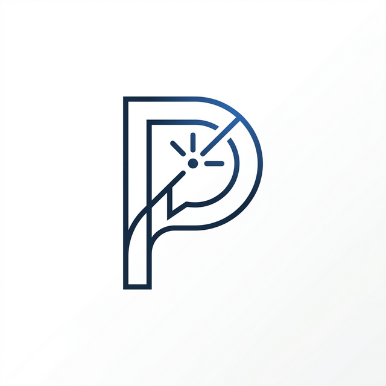
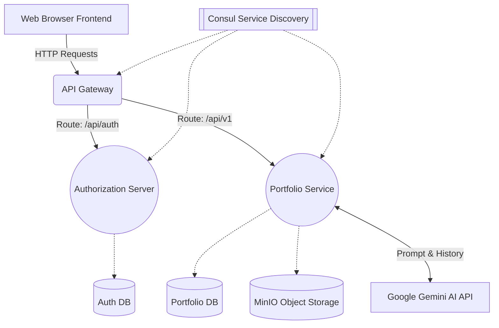

<div align="center">
  
  <h1>🚀 Profolio AI</h1>
  <p><i>Turn static Resumes into Interactive Portfolios - Where an AI "Persona" plays the role of YOU in front of recruiters.</i></p>

  <p>
    
    
    
    
    
    
  </p>
</div>

---

## 📋 Overview

**Profolio AI** is a groundbreaking, interactive platform that moves beyond traditional static portfolios where recruiters only "scroll" and "read".

This project allows users to upload their CV/Resume. The AI then processes, analyzes, and extracts the rich contextual data from this document to **roleplay as the user**. 

Instead of forcing viewers to blindly search for information, when a recruiter or guest visits your Portfolio link, they will experience a direct **"mock interview" (Interactive Chat)** with the AI. The AI intelligently and naturally answers questions about your work experience, skills, projects, and education... as if you were sitting right in front of the screen answering them.

## 🌟 Core Features

- 🤖 **Interactive AI Persona**: Powered by Google Gemini, the AI assumes your persona, speaks in the first-person, and communicates with visitors on your behalf.
- 📄 **Smart CV Context (RAG/LLM)**: Seamlessly processes your uploaded resume to fully learn your background, skills, and projects.
- 🔗 **Shareable Public Links**: Generate and share your interactive portfolio via a public web link in seconds.
- 📸 **Project Showcase**: Display your projects with rich descriptions and carousels natively within the chat interface.
- 🔐 **Grade-A Security**: Enforces an OAuth2 Server architecture alongside the BFF (Backend-for-Frontend) Pattern for absolute data security and session management.

## 🚀 Tech Stack

### 🎨 Frontend (`profolio-fe`)
- **Core**: React 18.3.1, TypeScript 5.8.2, Vite 6.2.0
- **UI & Animation**: Tailwind CSS, Framer Motion, Lucide React
- **Network & State**: Axios, React Router v6

### ⚙️ Backend Services (`profolio-be`)

| Service | Core Technology | Role |
|---|---|---|
| **API Gateway (AGW)** | Spring Cloud Gateway | Front-door routing, load balancing, and edge security. |
| **Auth Server** | Spring Auth Server / Spring Security | Manages OAuth2/OIDC standards, user identity, and BFF Token exchange. |
| **Portfolio Service** | Spring Boot, SpringAI, Google Gemini | Core business logic, LLM integration, user configuration, and interactions. |
| **Infrastructure** | PostgreSQL, MinIO, Consul | Persistent storage, S3-compatible object storage, and service discovery. |

## 🏗️ Architecture Design

Profolio AI operates on a modern microservices architecture with a dedicated Authorization Server handling the secure OAuth2 Authorization Code flow via a BFF implementation.



### Security Flow (BFF + HttpOnly Cookies)
The system embraces a closed-loop authentication design ensuring Access Tokens are never exposed to the browser.
- ✅ **Secure Storage**: Access & Refresh Tokens are persisted solely on the Auth Server backend.
- ✅ **HttpOnly Cookies**: Prevents Cookie theft (XSS).
- ✅ **Secure Exchange**: The Frontend only passes a short-lived Authorization Code which the BFF exchanges internally for a Token.

## 📁 Project Structure

```text
profolio_ai/
├── docker-compose.yml        # All-in-one local deployment
├── profolio-fe/              # Frontend Application (React/Vite)
│   ├── src/components/       # UI Components & Pages
│   └── src/services/         # API integrations
│
└── profolio-be/              # Backend Microservices Hub
    ├── AGW/                  # API Gateway Service
    ├── AuthorizationServer/  # Identity & OAuth2 Provider
    └── PortfolioService/     # Main Business & AI Logic Service
```

## 🛠️ Quick Start (Docker)

The fastest way to spin up the entire system (Frontend, All 3 Backend Services, PostgreSQL, MinIO, and Consul) is via Docker Compose.

### Prerequisites
- **Docker** and **Docker Compose** installed
- A valid **Google Gemini API Key**

### 1. Environment Setup
Create a `.env` file in the root directory and inject your Gemini API key and public URL (if deploying):

```env
GOOGLE_AI_API_KEY=your_gemini_api_key_here
PUBLIC_URL=http://localhost:4000
MINIO_PUBLIC_URL=http://localhost:9002
```

### 2. Launch Everything
Run the following command at the root directory:

```bash
docker compose up -d --build
```

### 3. Access the Application
Once all containers report as "healthy", you can access the platform at:
- **Frontend App**: `http://localhost:4000`
- **Consul Dashboard**: `http://localhost:8500`
- **MinIO Console**: `http://localhost:9001` (Credentials: `minioadmin` / `minioadmin`)

*(Note: During the first launch, it may take 1-2 minutes for all services to initialize and register with Consul).*

## 🤝 Contributing
The project is actively expanding and we welcome **Issues** and **Pull Requests**. Whether it's adding a new AI personality trait, optimizing the UI, or enhancing the backend architecture — your contributions are appreciated!

---

<div align="center">
  <p>Developed with passion for Open Source ❤️ | License: <b>MIT</b></p>
  <b>Happy Coding! 🚀</b>
</div>
